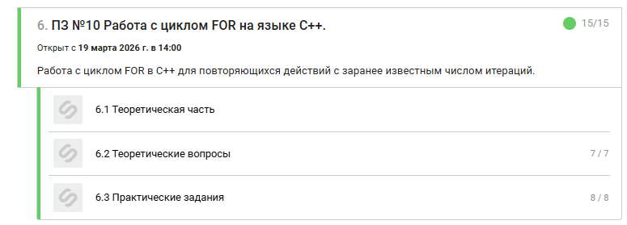

# ПЗ-10
  

  
----------------------------------------------------------------------------------------------------------------------------
## Задание 1

```
#include <iostream>

using namespace std;

int main() {
    setlocale(LC_ALL, "Russian");

    int N;
    cin >> N;

    // Ваш код:
    for (int i = 1; i <= N; i++) {
        cout << i << " ";
    }

    return 0;
}
```

----------------------------------------------------------------------------------------------------------------------------
## Задание 2

```
#include <iostream>

using namespace std;

int main() 
{
    setlocale(LC_ALL, "Russian");

    int N;
    cin >> N;

    for (int i = N; i >= 1; i--)  
    {
        cout << i << " ";  
    }
    return 0;
}
```

----------------------------------------------------------------------------------------------------------------------------
## Задание 3

```
#include <iostream>

using namespace std;

int main() {
    setlocale(LC_ALL, "Russian");

    int N;
    cin >> N;

    // Ваш код:
    // Используем формулу суммы арифметической прогрессии: S = n * (n + 1) / 2
    // Приводим к long long, чтобы избежать переполнения при умножении
    long long sum = (long long)N * (N + 1) / 2;
    
    cout << sum << endl;

    return 0;
}
```

----------------------------------------------------------------------------------------------------------------------------
## Задание 4

```
#include <iostream>

using namespace std;

int main() {
    setlocale(LC_ALL, "Russian");

    int N;
    cin >> N;

    // Ваш код:
    for (int i = 2; i <= N; i += 2) {
        cout << i << " ";
    }

    return 0;
}
```

----------------------------------------------------------------------------------------------------------------------------
## Задание 5

```
#include <iostream>

using namespace std;

int main()
{
    setlocale(LC_ALL, "Russian");

    int N;
    cin >> N;

    int sum = 0;
    for (int i = 1; i <= N; i++) 
    {
        if (i % 2 == 0)
        {
            sum ++;
        }
    }
    cout << sum;
    return 0;
}
```

----------------------------------------------------------------------------------------------------------------------------
## Задание 6

```
#include <iostream>

using namespace std;

int main()
{
    setlocale(LC_ALL, "Russian");

    int N;
    cin >> N;
    int f = 1;

    for (int i = 1; i <= N; i++) 
    {
            f *= i;  
    }
    cout << f;

    return 0;
}
```

----------------------------------------------------------------------------------------------------------------------------
## Задание 7

```
#include <iostream>

using namespace std;

int main()
{
    setlocale(LC_ALL, "Russian");

    int N;
    cin >> N;
    int s = 1;
    for (int i = 1; i <= 10; i++)
    {  
        cout << N <<  " * " << i << " = " << N * i << endl;
    }

    return 0;
}
```

----------------------------------------------------------------------------------------------------------------------------
## Задание 8

```
#include <iostream>

using namespace std;

int main() {
    setlocale(LC_ALL, "Russian");

    int N;
    cin >> N;

    // Ваш код:
    // Внешний цикл отвечает за строки (их будет N)
    for (int i = 0; i < N; i++) {
        // Внутренний цикл отвечает за звездочки в одной строке (их тоже N)
        for (int j = 0; j < N; j++) {
            cout << "*";
        }
        // После печати каждой строки переводим курсор на новую строку
        cout << endl;
    }

    return 0;
}
```
